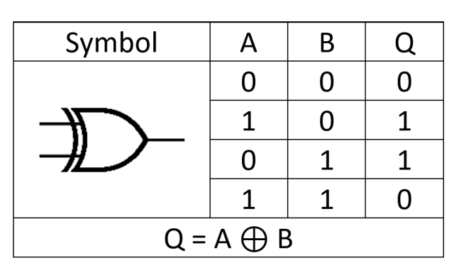

目标：
1. 掌握flip的含义

内容
1. flip's meaning in tick array 
### Meaning of “flip” here

- “Flip” means a tick’s initialized status toggled due to the liquidity update:
  - Add liquidity: tick’s liquidity_gross changes from 0 → >0 → flipped = true (tick became initialized).
  - Remove liquidity: tick’s liquidity_gross changes from >0 → 0 → flipped = true (tick became uninitialized).
  - Otherwise, flipped = false.

- Downstream effect when flipped:
  - The tick array’s `initialized_tick_count` is incremented/decremented.
  - If that count transitions 0 ↔ 1, the pool toggles the corresponding bit in `tick_array_bitmap` (or the extension), i.e., “flips” the bit for that tick array’s start index.

So, “flip” indicates a state transition of the boundary ticks (lower/upper) that may in turn flip the tick-array bitmap bit when the array becomes initialized for the first time or becomes empty again.

2. Formula 
  // Either liquidity_gross_after becomes 0 (uninitialized) XOR liquidity_gross_before
        // was zero (initialized)
        let flipped = (liquidity_gross_after == 0) != (liquidity_gross_before == 0);

        liquidity_gross_before == 0  true 
        liquidity_gross_after !=0  false 
        flipped = true  == false != true 

        liquidity_gross_before == 0  true 
        liquidity_gross_after == 0  true 
        flipped = false = true != true 

fn flip_tick_array_bit_internal(&mut self, tick_array_start_index: i32) -> Result<()> {
        let tick_array_offset_in_bitmap = self.get_tick_array_offset(tick_array_start_index)?;
        msg!("tick_array_offset_in_bitmap: {}", tick_array_offset_in_bitmap);
        let tick_array_bitmap = U1024(self.tick_array_bitmap);
        let mask = U1024::one() << tick_array_offset_in_bitmap.try_into().unwrap();
        self.tick_array_bitmap = tick_array_bitmap.bitxor(mask).0;
        Ok(())
}

2.1 flip_tick_upper == true 
flipped_upper = tick_upper_state.update(
            pool_state.tick_current,
            liquidity_delta,
            pool_state.fee_growth_global_0_x64,
            pool_state.fee_growth_global_1_x64,
            true,
            &updated_reward_infos,
        )?;
msg!("flipped_upper: {}", flipped_upper);

tick_lower_state:
tick_lower_state: TickState { tick: -2280, liquidity_net: 1472975494, liquidity_gross: 1472975494, fee_growth_outside_0_x64: 0, fee_growth_outside_1_x64: 0, reward_growths_outside_x64: [0, 0, 0], padding: [0, 0, 0, 0, 0, 0, 0, 0, 0, 0, 0, 0, 0] }

tick_upper_state:
 TickState { tick: 4020, liquidity_net: 0, liquidity_gross: 0, fee_growth_outside_0_x64: 0, fee_growth_outside_1_x64: 0, reward_growths_outside_x64: [0, 0, 0], padding: [0, 0, 0, 0, 0, 0, 0, 0, 0, 0, 0, 0, 0] }

liquidity_delta: 54921110

pool_state: PoolState { 
    bump: [253], 
    amm_config: AENbU71VcXS6eCaegq4zGJtJCE7xyRLoiE7A3kvibF89, 
    owner: 3xbCoRgPcuUhUdsVJHrq79gmcGUT3VwqrHgMTkV296cP, 
    token_mint_0: So11111111111111111111111111111111111111112, 
    token_mint_1: YLp1dtgW6K5rVuGdN3bfbLFbYBhqNmicDhGdKrWrtTu, 
    token_vault_0: 8dLbB4QYmJYSeDZjmmp2rHU114w1yJd1ej6goehQJeZR, 
    token_vault_1: 4MkTaDvG53WEJ6FSz1KNuApcgkA7hoE1wjCfrokFgPvn, 
    observation_key: 5ZHE1vVppYSM8wTpxqVG9juKAVddTneXEDhKTWJr9HYw, 
    mint_decimals_0: 9, 
    mint_decimals_1: 9, 
    tick_spacing: 60, 
    liquidity: 1472975494, 
    sqrt_price_x64: 18446744073709551616, 
    tick_current: 0, 
    padding3: 0, 
    padding4: 0, 
    fee_growth_global_0_x64: 0, 
    fee_growth_global_1_x64: 0, 
    protocol_fees_token_0: 0, 
    protocol_fees_token_1: 0, 
    swap_in_amount_token_0: 0, 
    swap_out_amount_token_1: 0, 
    swap_in_amount_token_1: 0, 
    swap_out_amount_token_0: 0, 
    status: 0, 
    padding: [0, 0, 0, 0, 0, 0, 0], 
    reward_infos: [RewardInfo { reward_state: 0, open_time: 0, end_time: 0, last_update_time: 0, emissions_per_second_x64: 0, reward_total_emissioned: 0, reward_claimed: 0, token_mint: 11111111111111111111111111111111, token_vault: 11111111111111111111111111111111, authority: 3xbCoRgPcuUhUdsVJHrq79gmcGUT3VwqrHgMTkV296cP, reward_growth_global_x64: 0 }, RewardInfo { reward_state: 0, open_time: 0, end_time: 0, last_update_time: 0, emissions_per_second_x64: 0, reward_total_emissioned: 0, reward_claimed: 0, token_mint: 11111111111111111111111111111111, token_vault: 11111111111111111111111111111111, authority: 3xbCoRgPcuUhUdsVJHrq79gmcGUT3VwqrHgMTkV296cP, reward_growth_global_x64: 0 }, RewardInfo { reward_state: 0, open_time: 0, end_time: 0, last_update_time: 0, emissions_per_second_x64: 0, reward_total_emissioned: 0, reward_claimed: 0, token_mint: 11111111111111111111111111111111, token_vault: 11111111111111111111111111111111, authority: 3xbCoRgPcuUhUdsVJHrq79gmcGUT3VwqrHgMTkV296cP, reward_growth_global_x64: 0 }], 
    tick_array_bitmap: [0, 0, 0, 0, 0, 0, 0, 9223372036854775808, 1, 0, 0, 0, 0, 0, 0, 0], 
    total_fees_token_0: 0, 
    total_fees_claimed_token_0: 0, 
    total_fees_token_1: 0, 
    total_fees_claimed_token_1: 0, 
    fund_fees_token_0: 0, 
    fund_fees_token_1: 0, 
    open_time: 0, 
    recent_epoch: 0, 
    padding1: [0, 0, 0, 0, 0, 0, 0, 0, 0, 0, 0, 0, 0, 0, 0, 0, 0, 0, 0, 0, 0, 0, 0, 0], 
    padding2: [0, 0, 0, 0, 0, 0, 0, 0, 0, 0, 0, 0, 0, 0, 0, 0, 0, 0, 0, 0, 0, 0, 0, 0, 0, 0, 0, 0, 0, 0, 0, 0] }

    protocol_position_state: 
    ProtocolPositionState { 
        bump: 254, 
        pool_id: 4i9jsM4K3PwPbVhEirG4Czjav9gvThPgLZA8LPQvfMad, 
        tick_lower_index: -2280, 
        tick_upper_index: 4020, 
        liquidity: 0, 
        fee_growth_inside_0_last_x64: 0, 
        fee_growth_inside_1_last_x64: 0, 
        token_fees_owed_0: 0, 
        token_fees_owed_1: 0, 
        reward_growth_inside: [0, 0, 0], 
        recent_epoch: 0, 
        padding: [0, 0, 0, 0, 0, 0, 0] 
        }