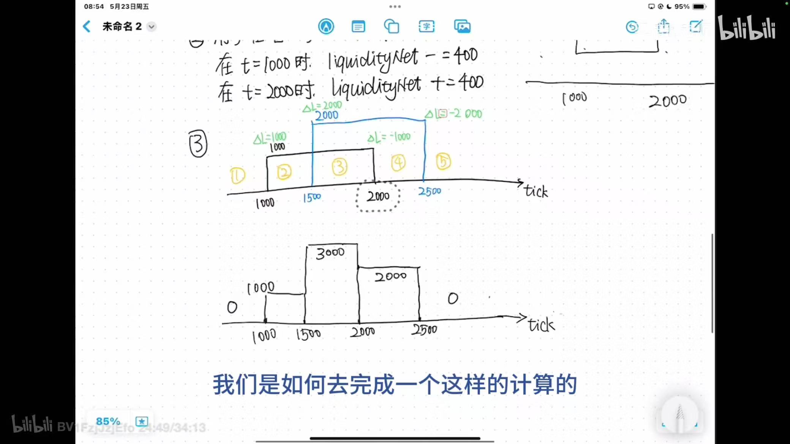

目标：
1. 掌握liquidity——net定义

内容：
1. 定义

1.1 流动性分类
池子流动性：
pub struct PoolState {
    /// The currently in range liquidity available to the pool.
    pub liquidity: u128,
}

SwapState:
pub struct SwapState {
    // the current liquidity in range
    pub liquidity: u128, 
}

1.2 流动性的来源
1）池子流动性的来源？
我目前通过open position添加了流动性，所以目前池子流动性应该就是我当前添加的流动性数量？
实验：查看池子，打印出池子的信息（包含流动性）
池子流动性：363379595  和LP添加的数量一致

2）SwapState的流动性来源？
初始来源：
let liquidity_start = pool_state.liquidity;
let mut state = SwapState {
    liquidity: liquidity_start,
};

1.3 流动性的变化情况
1）SwapState的流动性变化情况
方向： zero_for_one ；
数量： 1000；

2) PoolState流动性
不受swap影响，PoolState流动性不变

1.4 池子价格变化
方向： zero_for_one ；
数量： 20000；
state.sqrt_price_x64：583331193482769486   price:0.9999791772022444
step.sqrt_price_next_x64:521037230575395660 price:0.7978074153597088

继续：
方向： zero_for_one ；
数量： 20000；
state.sqrt_price_x64:583330181263634387     price：0.9999757067991836
step.sqrt_price_next_x64:521037230575395660

继续:
方向： zero_for_one ； 
数量： 1000000000；
> Program log: state.sqrt_price_x64:536759845836758780   price: 0.8466825204893473
> Program log: step.sqrt_price_next_x64:521037230575395660

继续
方向： zero_for_one ； 
数量： 1000000000；
> Program log: state.sqrt_price_x64:536759845836758780   price: 0.8466825204893473
> Program log: step.sqrt_price_next_x64:521037230575395660

创建一个新的liquidity tick range , 价格在0.6-0.8之间，这样，当价格越过流动性边界时，不会报流动性不足错误。报错原因：
thread 'main' panicked at client/src/instructions/utils.rs:435:58:
called `Option::unwrap()` on a `None` value
note: run with `RUST_BACKTRACE=1` environment variable to display a backtrace

查看代码发现，是发现寻找的next_initialized_tick 没有被initialized, 所以就开始去寻找下一个tickArray，但是发现没有，返回None，报错。 
let current_vaild_tick_array_start_index = pool_state
                .next_initialized_tick_array_start_index(
                    &Some(*tickarray_bitmap_extension),
                    current_vaild_tick_array_start_index,
                    zero_for_one,
                )
                .unwrap();
这里的next_initialized_tick = 0 ，
last_tick_array_start_index:-1846800
last_tick_array_start_index < tick_math::MIN_TICK
                || last_tick_array_start_index > tick_math::MAX_TICK

/// The minimum tick
pub const MIN_TICK: i32 = -443636;
/// The minimum tick
pub const MAX_TICK: i32 = -MIN_TICK;

next_initialized_tick是怎么计算的？ 
current_tick_index:-71341
offset_in_array:10 
倒数offset到0，都没有发现initialized tick返回None，所以next_intitlized_tick值为0.

tickLower (index): -71340
tickUpper (index): -67260

刚开始tick是 pool_price对应的tick，pool_state.tick_current:-71204 ；
然后是next_initialized_tick -71340，也就是左边界。

循环逻辑：  // loop across ticks until input liquidity is consumed, or the limit price is reached
达到限定价格，进入下一个跨越tick，进入下一个tick区间。
if state.sqrt_price_x64 == step.sqrt_price_next_x64 {
 state.tick = if zero_for_one {
                step.tick_next - 1
            }
    ...
}
继续越过下边界state.tick:-71341
tick_index: -71341
继续，最后发现，当前的liquidity已经被消耗完，但是input还没有被完全消耗掉，所以打算进入下一个initialized tick继续消耗，但是发现下一个initialized tick没有了，如是打算计入下一个tickArray，发现还是没有，于是报错。

现在我新开一个poistion,范围在 0.6-0.8，这样的话，就有下一个initialized tick或tickArray了。 
0.6 tickLower (index): -74220
0.8 tickUpper (index): -71340

问题：Program Error: "Instruction #2 Failed - custom program error: 6027 | Not enought tick array account"
state.sqrt_price_x64:521037230575395660
step.sqrt_price_next_x64:521037230575395660
next_initialized_tick.tick:-71340
state.liquidity before add_delta:848730872
liquidity_net:-363379595
state.liquidity after add_delta:485351277
方案： upgrade合约后，好像就好了?  就可以获取到下一个tick了。
current_tick_index:-71341
offset_in_array:10
next_initialized_tick 0
next_initialized_tick is not initialized
tick_index: -72000
tick_spacing: 60
ticks_in_array: 3600
start: -20
start: -20
length of tickarrays 1 
current_vaild_tick_array_start_index Some(-75600)  【获取到新的tickArray】
tick: -74220 []

这是因为在swap时候，会    // load tick_arrays
            let mut tick_arrays = load_cur_and_next_five_tick_array(
                &rpc_client,
                &pool_config,
                &pool_state,
                &tickarray_bitmap_extension,
                zero_for_one,
            );
但是当前的tick_arrays size 为1， 也就是说目前只有一个tickArray，他能够覆盖价格范围是0.8-1.2.

而是会进行跨tick，进入0.6-0.8的tick range. 

2）池子流动性变化

a). 变化量针对的是pool liquidity  
b). 结合这个图就可以很好的理解 左右移动的时，减net和➕net的原因了.

2. 实验：掌握cross时候，向左，减少； 向右，增加，的现象验证，原理解释

3. range的理解