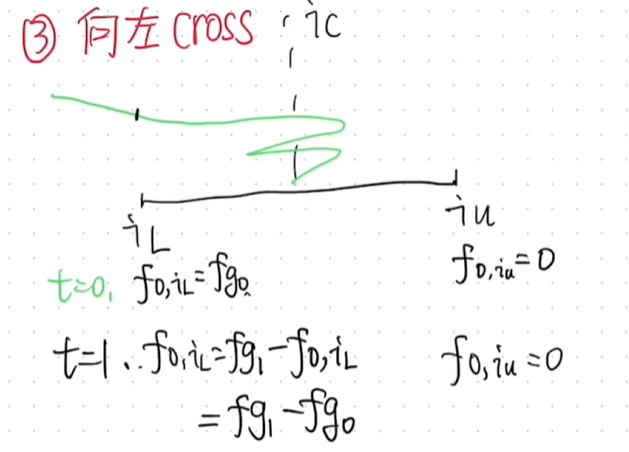

目标：
1. 掌握如何计算一个LP在其position内应得的手续费

内容：
1. 手续费计算

fr = fg - fb(il) - fa(iu)
其中，il,iu就是tick_lower 和 tick_upper. 【TODO:】暂时不知道fa,fb的计算方式。fg是全局状态。
如果能知道fa,fb，我们就能够知道一个LP在某一个价格区间内【tick_lower,tick_upper】它的单位流动性的fee_growth,然后根据LP提供了多少的liquidity * fee_growth，就获取到了可领取的手续费。

1.1 如何计算fa,fb的值？
V3维护了一个状态，叫做feeoutside,每次cross tick时候，会更新这个feeoutside.
会借助fo来计算fa,fb.

1) 初始化逻辑

如果理解， fo,i = fg  当i<<ic？
在我添加流动性之前的fee和我没有关系，添加后的才有关系，所以要记录下之前的fg，方便做区分。

2） 更新逻辑 [在实践过程中去理解]
fo,i = fg -fo,i   【fg是穿越时刻的fg】

举例：场景1-区间内

场景2-向右穿越

场景2-向左穿越

3) 如何通过fo来计算fa,fb.  [看高度差]

再看fa与fo关系

